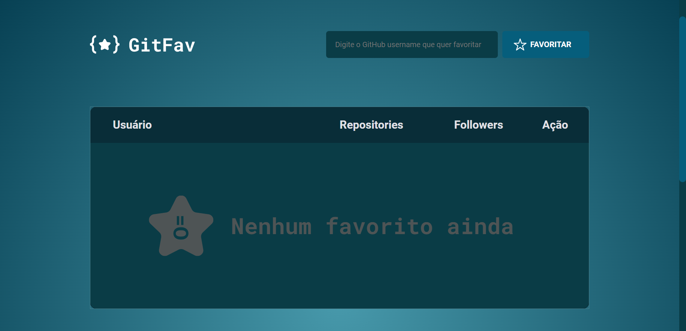

# GitFav
GitFav is a web application to select your favorite GitHub users and list them in a table. By doing this, you can also see how many public repositories and followers they have.  
This project was made for the Rocketseat Explorer course.  
To make it, I used:  
- ES6 modules  
- Oriented object programming (classes, inheritance, polymorphism...)  
- Promises  
- GitHub API with fetch

## Tecs
- HTML  
- CSS  
- JS
 
